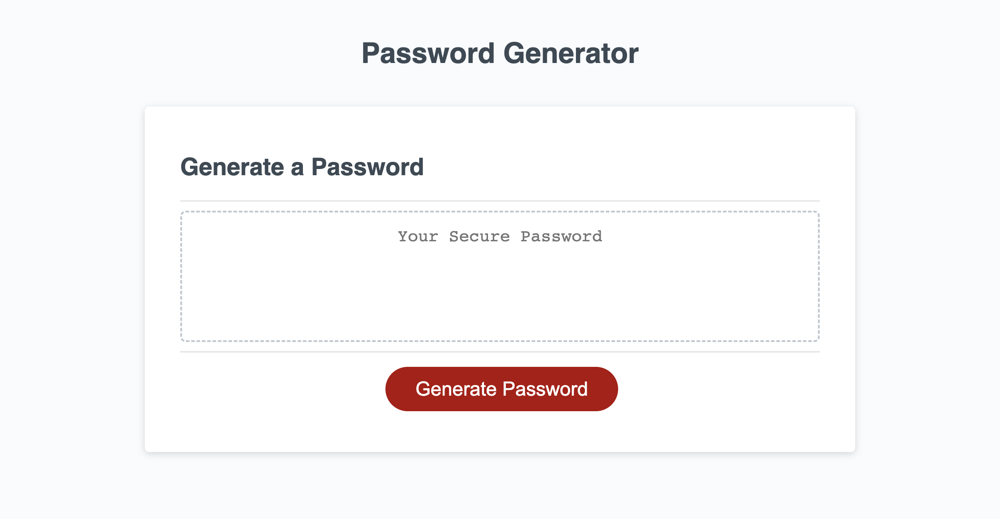
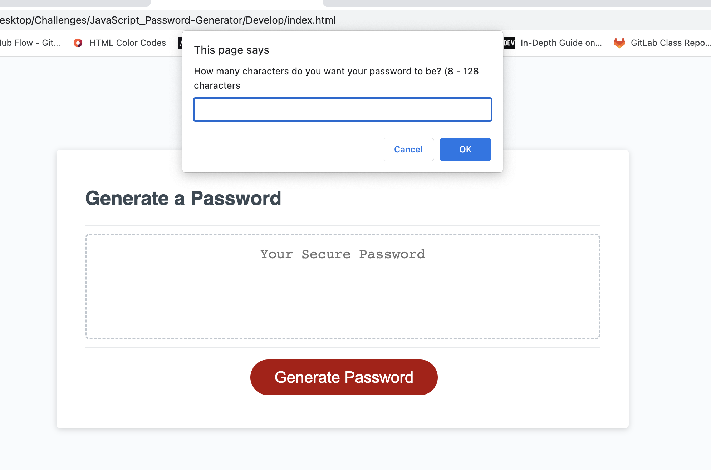
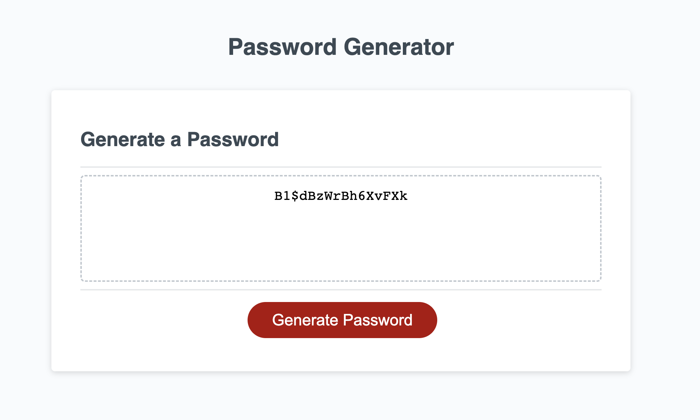

# JavaScript_Password-Generator

## Description

* As a developer, I wanted to create a web application that would generate random passwords between 8 and 128 characters, with specific prompts for certain characters.

## Acceptance Criteria

```
GIVEN I need a new, secure password
WHEN I click the button to generate a password
THEN I am presented with a series of prompts for password criteria
WHEN prompted for password criteria
THEN I select which criteria to include in the password
WHEN prompted for the length of the password
THEN I choose a length of at least 8 characters and no more than 128 characters
WHEN asked for character types to include in the password
THEN I confirm whether or not to include lowercase, uppercase, numeric, and/or special characters
WHEN I answer each prompt
THEN my input should be validated and at least one character type should be selected
WHEN all prompts are answered
THEN a password is generated that matches the selected criteria
WHEN the password is generated
THEN the password is either displayed in an alert or written to the page
```

## Usage

* This webpage can be used to generate random passwords between 8 and 128 characters with letters, numbers, and special characters. Below is the link to the deployed website.

* Link: https://candaceg00.github.io/JavaScript_Password-Generator/

* Screenshots:
    
    
    


## Credits

* I worked on this project with some assistance from classmate Edward Kim. I also referenced this video to assist me with some areas of the JavaScript for the project. Video is: <a href="https://www.youtube.com/watch?v=v2jfGo7ztm8">JavaScript Random Password Generator</a>